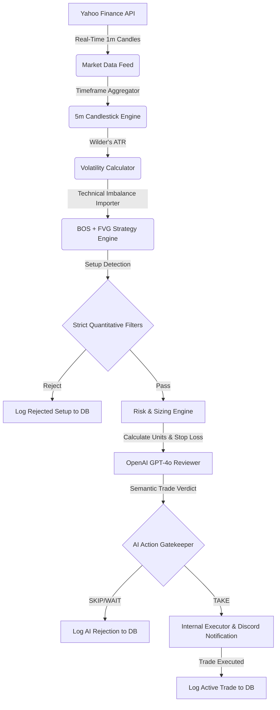

The Autonomous Quantitative Trading System is a custom pipeline designed to trade financial markets by programmatically detecting high-probability structural inefficiencies and applying a multi-agent validation layer before executing any order.

Live Streamlit Showcase: [Launch Streamlit Portfolio Dashboard](https://tradingprogram-p3dzf9qeuejnw3yrj4ck2i.streamlit.app/)

## Key Pillars

### 1. Market Data Ingestion
The system connects to Yahoo Finance (`yfinance`) to fetch live minute-interval candles. It aggregates and resamples this data to run multi-timeframe scans.

### 2. Fair Value Gaps & Breaks of Structure
Using a volatility-adjusted Wilder's ATR engine, the strategy detects **Fair Value Gaps (FVG)** and **Breaks of Structure (BOS)** to pinpoint entry zones, stop losses, and target partial take profits:
- **FVG**: A three-candle pattern where a rapid price expansion leaves a visual inefficiency (gap) between the first candle's high/low and the third candle's low/high.
- **BOS**: Confirms a trend change or trend continuation when the price breaks and closes past a recent structural swing high or swing low.

### 3. AI Execution Gatekeeper
Once a setup is identified quantitatively, the system builds a detailed semantic context including volume profile, key levels, index correlation, and trend momentum. It invokes the **OpenAI GPT-4o API** to run a qualitative check. If GPT-4o rejects the setup, the trade is skipped and logged to the DB. If it passes, it moves to execution.

### 4. Mathematical Risk Engine
The risk engine strictly enforces the **1% risk-to-capital rule**. Units are calculated based on the distance to the stop loss. The system automates multi-stage exits, trailing stops, and break-even stop adjustments.

## System Flow

## Tech Stack
- **Backend & Strategy**: Python, Pandas, SQLAlchemy (SQLite), Pydantic v2
- **APIs**: Yahoo Finance, OpenAI, Discord Webhooks
- **UI**: Streamlit, Plotly
